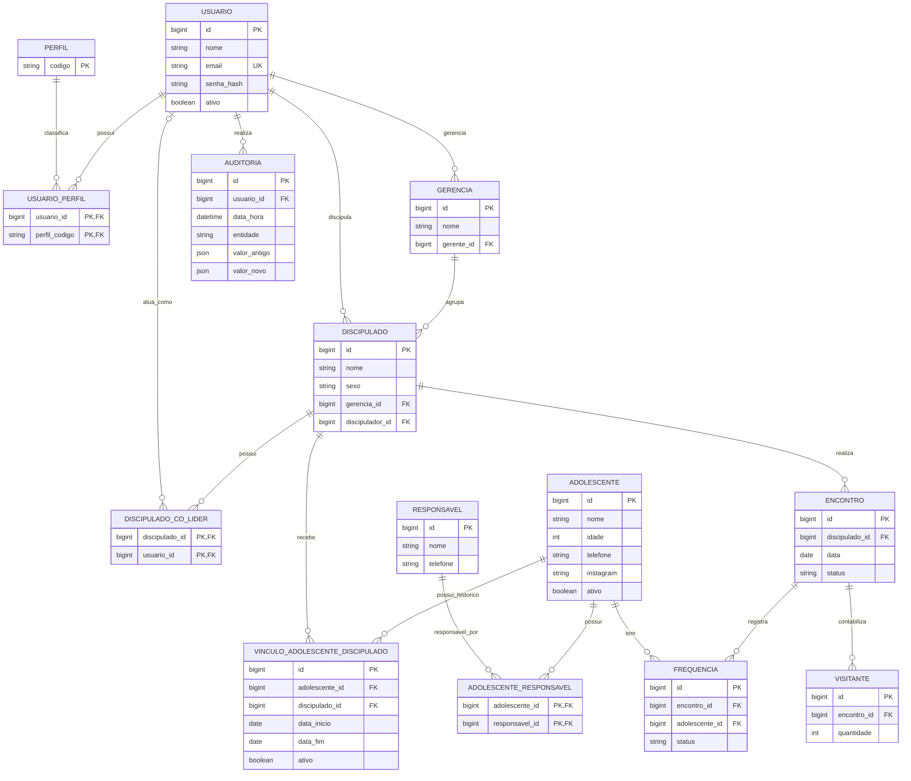

# Modelo Conceitual

## Diagrama Entidade-Relacionamento (DER)

## Restrições do modelo

- `PERFIL.codigo` aceita `ADMIN`, `GERENTE`, `DISCIPULADOR` e `CO_LIDER`. A tabela `USUARIO_PERFIL` permite que um usuário acumule papéis.
- Cada `GERENCIA` possui um gerente e cada `DISCIPULADO` pertence a uma única gerência.
- Cada `DISCIPULADO` possui exatamente um `discipulador_id` ativo. `DISCIPULADO_CO_LIDER` admite, no máximo, dois co-líderes por discipulado.
- Um mesmo `USUARIO` pode aparecer como discipulador ou co-líder em somente um `DISCIPULADO` no total. A implementação deve validar as duas relações em conjunto, na mesma transação, e proteger o invariante contra associações concorrentes.
- `VINCULO_ADOLESCENTE_DISCIPULADO` preserva o histórico. Deve existir somente um vínculo ativo por adolescente; o vínculo do período do encontro mantém o histórico associado ao discipulado correto.
- Deve haver, no máximo, um `ENCONTRO` para cada par (`discipulado_id`, `data`) e uma `FREQUENCIA` para cada par (`encontro_id`, `adolescente_id`). O status do encontro é `REALIZADO` ou `CANCELADO`; cancelamentos exigem `justificativa` e encontros realizados mantêm esse campo nulo.
- Alterações em frequência devem gerar `AUDITORIA`, com usuário responsável, data/hora e valores anterior e novo.

## Entidades Principais

### Usuario

- id
- nome
- email
- senha
- ativo

### Perfil

- ADMIN
- GERENTE
- DISCIPULADOR
- CO_LIDER

### Gerencia

- id
- nome

### Discipulado

- id
- nome
- sexo
- gerente_id

### Adolescente

- id
- nome
- idade
- telefone
- instagram
- ativo

### Responsavel

- id
- nome
- telefone

### Encontro

- id
- data
- status

### Frequencia

- id
- encontro_id
- adolescente_id
- status

### Visitante

- id
- encontro_id
- quantidade

### Auditoria

- id
- usuario
- data_hora
- entidade
- valor_antigo
- valor_novo

## Próxima etapa

Transformar este documento em DER.
