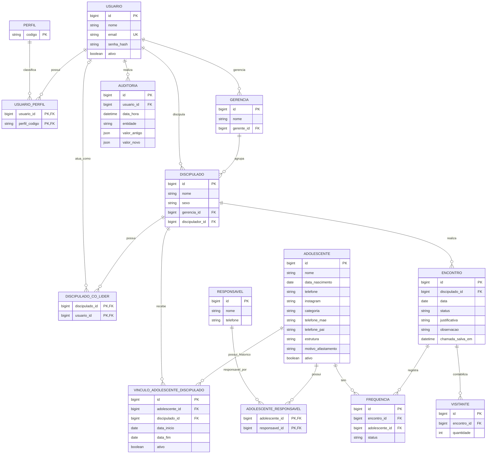

# Modelo Conceitual

## Diagrama Entidade-Relacionamento (DER)

```mermaid
erDiagram
    USUARIO {
        bigint id PK
        string nome
        string email UK
        string senha_hash
        boolean ativo
    }
    PERFIL {
        string codigo PK
    }
    USUARIO_PERFIL {
        bigint usuario_id PK, FK
        string perfil_codigo PK, FK
    }
    GERENCIA {
        bigint id PK
        string nome
        bigint gerente_id FK
    }
    DISCIPULADO {
        bigint id PK
        string nome
        string sexo
        bigint gerencia_id FK
        bigint discipulador_id FK
    }
    DISCIPULADO_CO_LIDER {
        bigint discipulado_id PK, FK
        bigint usuario_id PK, FK
    }
    ADOLESCENTE {
        bigint id PK
        string nome
        date data_nascimento
        string telefone
        string instagram
        string categoria
        string telefone_mae
        string telefone_pai
        string estrutura
        string motivo_afastamento
        boolean ativo
    }
    VINCULO_ADOLESCENTE_DISCIPULADO {
        bigint id PK
        bigint adolescente_id FK
        bigint discipulado_id FK
        date data_inicio
        date data_fim
        boolean ativo
    }
    RESPONSAVEL {
        bigint id PK
        string nome
        string telefone
    }
    ADOLESCENTE_RESPONSAVEL {
        bigint adolescente_id PK, FK
        bigint responsavel_id PK, FK
    }
    ENCONTRO {
        bigint id PK
        bigint discipulado_id FK
        date data
        string status
        string justificativa
        string observacao
        datetime chamada_salva_em
    }
    FREQUENCIA {
        bigint id PK
        bigint encontro_id FK
        bigint adolescente_id FK
        string status
    }
    VISITANTE {
        bigint id PK
        bigint encontro_id FK
        int quantidade
    }
    AUDITORIA {
        bigint id PK
        bigint usuario_id FK
        datetime data_hora
        string entidade
        json valor_antigo
        json valor_novo
    }

    USUARIO ||--o{ USUARIO_PERFIL : possui
    PERFIL ||--o{ USUARIO_PERFIL : classifica
    USUARIO ||--o{ GERENCIA : gerencia
    GERENCIA ||--o{ DISCIPULADO : agrupa
    USUARIO ||--o{ DISCIPULADO : discipula
    DISCIPULADO ||--o{ DISCIPULADO_CO_LIDER : possui
    USUARIO o|--o{ DISCIPULADO_CO_LIDER : atua_como
    ADOLESCENTE ||--o{ VINCULO_ADOLESCENTE_DISCIPULADO : possui_historico
    DISCIPULADO ||--o{ VINCULO_ADOLESCENTE_DISCIPULADO : recebe
    ADOLESCENTE ||--o{ ADOLESCENTE_RESPONSAVEL : possui
    RESPONSAVEL ||--o{ ADOLESCENTE_RESPONSAVEL : responsavel_por
    DISCIPULADO ||--o{ ENCONTRO : realiza
    ENCONTRO ||--o{ FREQUENCIA : registra
    ADOLESCENTE ||--o{ FREQUENCIA : tem
    ENCONTRO ||--o{ VISITANTE : contabiliza
    USUARIO ||--o{ AUDITORIA : realiza
```

## Restrições do modelo

- `PERFIL.codigo` aceita `ADMIN`, `GERENTE`, `DISCIPULADOR` e `CO_LIDER`. A tabela `USUARIO_PERFIL` permite que um usuário acumule papéis.
- Cada `GERENCIA` possui um gerente e cada `DISCIPULADO` pertence a uma única gerência.
- Cada `DISCIPULADO` possui exatamente um `discipulador_id` ativo. `DISCIPULADO_CO_LIDER` admite, no máximo, dois co-líderes por discipulado.
- Um mesmo `USUARIO` pode aparecer como discipulador ou co-líder em somente um `DISCIPULADO` no total. A implementação deve validar as duas relações em conjunto, na mesma transação, e proteger o invariante contra associações concorrentes.
- `VINCULO_ADOLESCENTE_DISCIPULADO` preserva o histórico. Deve existir somente um vínculo ativo por adolescente; o vínculo do período do encontro mantém o histórico associado ao discipulado correto.
- Deve haver, no máximo, um `ENCONTRO` para cada par (`discipulado_id`, `data`) e uma `FREQUENCIA` para cada par (`encontro_id`, `adolescente_id`). O status do encontro é `REALIZADO` ou `NAO_REALIZADO`; encontros não realizados exigem `justificativa` e encontros realizados mantêm esse campo nulo. `observacao` é texto livre opcional (até 500 caracteres), independente da situação. `chamada_salva_em` registra o instante do primeiro salvamento da chamada e ancora a janela de edição de três horas.
- Alterações em frequência devem gerar `AUDITORIA`, com usuário responsável, data/hora e valores anterior e novo.

## Entidades Principais

### Usuario

- id
- nome
- email
- senha
- ativo

### Perfil

- ADMIN
- GERENTE
- DISCIPULADOR
- CO_LIDER

### Gerencia

- id
- nome

### Discipulado

- id
- nome
- sexo
- faixa_etaria
- gerencia_id
- discipulador_id (resposta da API também inclui `discipuladorNome`)

### Adolescente

- id
- nome
- data_nascimento
- telefone
- instagram
- categoria (`DISCIPULO`, `VISITANTE`, `DISCIPULO_GOE`)
- telefone_mae
- telefone_pai
- estrutura
- motivo_afastamento (obrigatório quando categoria = `DISCIPULO_GOE`)
- responsavel_nome / responsavel_telefone / consentimento_em
- ativo

### Responsavel

- id
- nome
- telefone

### Encontro

- id
- data
- status
- justificativa
- observacao
- chamada_salva_em

### Frequencia

- id
- encontro_id
- adolescente_id
- status

### Visitante

- id
- encontro_id
- quantidade

### Auditoria

- id
- usuario
- data_hora
- entidade
- valor_antigo
- valor_novo

## Próxima etapa

Transformar este documento em DER.
