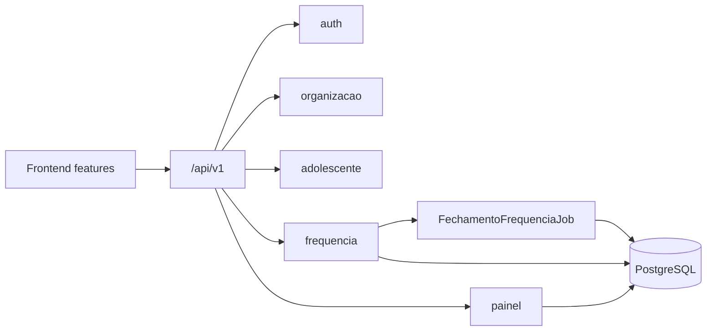

# Arquitetura

## Frontend

- React 18
- TypeScript
- Vite
- Material UI
- ECharts
- ESLint + Prettier + Vitest

## Backend

- Java 21
- Spring Boot 3
- Spring Security (JWT + refresh rotacionado)
- Spring Data JPA
- Hibernate
- Spotless, PMD, SpotBugs e JaCoCo

## Banco

- PostgreSQL
- Flyway (`backend/src/main/resources/db/migration/`)

## Relatórios

- HTML/CSS com impressão nativa do navegador (relatório de frequência por período)
- JasperReports e Excel permanecem no roadmap

## Infraestrutura

- Docker / Docker Compose
- Render (ver `docs/deploy-render.md`)
- Observabilidade OTLP (ver `docs/observability.md`)

## CI/CD

- GitHub Actions
- Husky + lint-staged + commitlint (pre-commit e commit-msg)

## Estrutura Backend

Pacote-por-domínio em `br.com.sgd`:

- `adolescente`
- `audit`
- `auth`
- `common` (contratos compartilhados, como `PaginaResponse`)
- `config`
- `exception`
- `frequencia` (encontros, chamada, prazo de lançamento, job de fechamento)
- `health`
- `observability`
- `organizacao` (gerências, discipulados, co-líderes)
- `painel` (`/painel/lider`, `/painel/gerencia`, `/painel/admin`)
- `relatorio`
- `user`

Cada pacote de domínio concentra controller, service, repository e entidades relacionadas.

### Fluxos operacionais relevantes

- **Prazo de lançamento**: sexta-feira lançável até domingo 23:59:59 `America/Sao_Paulo` para líder/co-líder; admin ignora o prazo.
- **Janela da chamada**: primeiro `PUT .../frequencias` grava `chamadaSalvaEm`; depois disso, líderes têm 3 horas; admin sempre pode.
- **Fechamento automático**: após o prazo, `FechamentoFrequenciaJob` marca sexta sem chamada como `NAO_REALIZADO` com justificativa padrão.
- **Observação do encontro**: campo opcional atualizado via `PATCH /encontros/{id}` (não entra no `POST` de criação).

## Estrutura Frontend

Organização por feature em `frontend/src`:

- `app/` — shell (`App`, `AuthenticatedApp`, `theme`, `main`)
- `shared/` — HTTP client, tipos, charts e UI (`DiscipuladoLiderancaInfo`, etc.)
- `features/` — módulos de domínio:
  - `auth`
  - `users`
  - `organizacao`
  - `adolescentes`
  - `frequencia`
  - `dashboards` (visão executiva admin/gerência, líder, detalhe)
  - `relatorios`
- `test/` — setup do Vitest

Imports entre pastas usam o alias `@/*`.

### Dashboards

| Perfil | Componente principal | API |
| --- | --- | --- |
| ADMIN | `ExecutiveDashboard` (`escopo=admin`) + `AdminDashboard` | `GET /painel/admin` |
| GERENTE | `ExecutiveDashboard` (`escopo=gerencia`) + `ManagerDashboard` | `GET /painel/gerencia` |
| DISCIPULADOR / CO_LIDER | `LeaderDashboard` | `GET /painel/lider` |

Perfis acumulados recebem a união das visões; o painel “Meu discipulado” sempre usa a associação de liderança.
